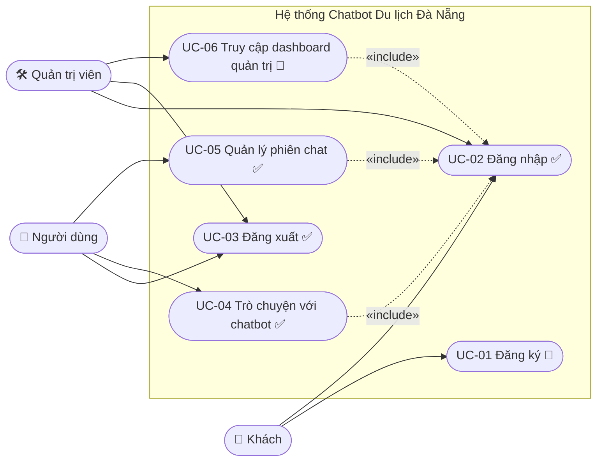
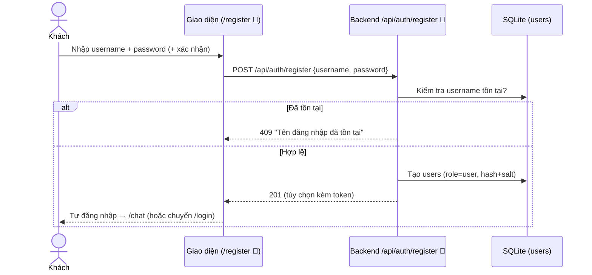

# Thiết kế Use Case & Kịch bản Đăng nhập — Chatbot Du lịch Đà Nẵng

> Tài liệu thiết kế cho phân hệ **xác thực & phân quyền**. Mô hình: **admin được cấp tài khoản sẵn**, **người
> dùng đăng nhập để dùng chatbot**, hỗ trợ **đăng ký** cho người dùng và **phân vai trò** (admin truy cập
> dashboard quản trị).
>
> Quy ước đánh dấu trạng thái:
> - ✅ **Đã hiện thực** trong mã nguồn hiện tại.
> - 🔧 **Đề xuất thiết kế** (chưa có trong mã — cần làm nếu triển khai).

---

## 1. Mục tiêu & phạm vi

**Mục tiêu:** Đảm bảo chỉ người dùng đã xác thực mới sử dụng được chatbot; mỗi người chỉ truy cập dữ liệu
(lịch sử trò chuyện, hồ sơ) của chính mình; quản trị viên có lối vào riêng cho khu vực quản trị.

**Trong phạm vi:** Đăng ký, đăng nhập, đăng xuất, phiên đăng nhập (token), phân quyền theo vai trò, điều kiện
truy cập chatbot và dashboard quản trị.

**Ngoài phạm vi:** Khôi phục mật khẩu qua email, đăng nhập mạng xã hội (OAuth), xác thực 2 lớp (2FA) — có thể
mở rộng sau.

---

## 2. Tác nhân (Actors)

| Tác nhân | Mô tả | Cách có tài khoản |
|----------|-------|-------------------|
| **Khách** (chưa đăng nhập) | Người vừa mở ứng dụng, chưa có phiên hợp lệ. Chỉ thấy trang Đăng nhập/Đăng ký. | — |
| **Người dùng** (đã đăng nhập, role `user`) | Du khách dùng chatbot tư vấn du lịch Đà Nẵng. | 🔧 Tự **đăng ký**, hoặc admin tạo qua `scripts/create_user.py`. |
| **Quản trị viên** (role `admin`) | Vận hành hệ thống: xem/chạy crawl dữ liệu, xem dashboard đánh giá (metrics). | ✅ Được **cấp sẵn** bằng `scripts/create_user.py`. |

---

## 3. Sơ đồ Use Case



> «include» Đăng nhập: các use case UC-04/05/06 chỉ thực hiện được sau khi đã đăng nhập (token hợp lệ).

---

## 4. Danh sách Use Case

| Mã | Tên | Tác nhân chính | Trạng thái |
|----|-----|----------------|-----------|
| UC-01 | Đăng ký tài khoản người dùng | Khách | 🔧 đề xuất |
| UC-02 | Đăng nhập | Khách → Người dùng/Admin | ✅ |
| UC-03 | Đăng xuất | Người dùng, Admin | ✅ |
| UC-04 | Trò chuyện với chatbot | Người dùng | ✅ |
| UC-05 | Quản lý phiên chat (xem/đổi tên/xóa) | Người dùng | ✅ |
| UC-06 | Truy cập dashboard quản trị | Admin | 🔧 đề xuất gác đăng nhập |

---

## 5. Đặc tả Use Case

### UC-02 — Đăng nhập ✅ (trọng tâm)

| Mục | Nội dung |
|-----|----------|
| **Mã / Tên** | UC-02 / Đăng nhập |
| **Tác nhân** | Khách (trở thành Người dùng hoặc Admin sau khi thành công) |
| **Mục đích** | Xác thực danh tính và cấp phiên (token) để truy cập chức năng cần đăng nhập |
| **Tiền điều kiện** | Tài khoản đã tồn tại (đăng ký hoặc được admin cấp); người dùng đang ở trang `/login` |
| **Hậu điều kiện (thành công)** | Có token hợp lệ lưu ở trình duyệt; điều hướng theo vai trò (user → `/chat`, admin → `/admin` 🔧) |
| **Hậu điều kiện (thất bại)** | Không cấp token; vẫn ở `/login`; hiển thị thông báo lỗi chung |

**Luồng sự kiện chính:**
1. Khách nhập **tên đăng nhập** và **mật khẩu**, bấm "Đăng nhập".
2. Giao diện gửi `POST /api/auth/login` với `{username, password}`.
3. Hệ thống tra người dùng theo `username`, băm mật khẩu nhập vào (PBKDF2-SHA256 + salt của người dùng) và so
   khớp **hằng thời gian** với `password_hash`.
4. Khớp → hệ thống sinh token ngẫu nhiên (`secrets.token_urlsafe`), lưu **SHA256(token)** vào `auth_tokens`
   kèm `expires_at` (mặc định **30 ngày**), trả về `{token, user:{id, username}}`.
5. Giao diện lưu token (localStorage `ppbl_auth_token`) và điều hướng theo vai trò.
6. Các yêu cầu sau tự đính kèm `Authorization: Bearer <token>`.

**Luồng phụ / ngoại lệ:**
- **A1 — Sai tài khoản/mật khẩu:** bước 3 không khớp → trả **401** với thông báo chung *"Sai tài khoản hoặc
  mật khẩu"* (không tiết lộ username có tồn tại hay không → chống dò tài khoản). Quay lại bước 1.
- **A2 — Bỏ trống trường:** giao diện chặn gửi, nhắc nhập đủ.
- **A3 — Token hết hạn ở các phiên sau:** xem KB3 (UC liên quan) — yêu cầu trả 401 → tự đăng xuất về `/login`.

**Quy tắc nghiệp vụ:**
- Không bao giờ lưu mật khẩu thô; chỉ lưu hash + salt.
- Token thô chỉ trả về 1 lần lúc đăng nhập; DB chỉ giữ bản băm.
- Thông báo lỗi đăng nhập luôn **chung chung**.

---

### UC-01 — Đăng ký tài khoản người dùng 🔧 (đề xuất)

| Mục | Nội dung |
|-----|----------|
| **Mã / Tên** | UC-01 / Đăng ký |
| **Tác nhân** | Khách |
| **Mục đích** | Cho phép du khách tự tạo tài khoản `user` để dùng chatbot |
| **Tiền điều kiện** | Khách ở trang `/register` (🔧 chưa có); chưa đăng nhập |
| **Hậu điều kiện** | Tạo bản ghi `users` (role=`user`); (tùy chọn) tự đăng nhập ngay |

**Luồng chính:**
1. Khách nhập `username`, `password`, (tùy chọn) nhập lại mật khẩu.
2. Giao diện gửi `POST /api/auth/register` 🔧.
3. Hệ thống kiểm tra `username` chưa tồn tại (ràng buộc UNIQUE), kiểm tra độ mạnh mật khẩu tối thiểu.
4. Băm mật khẩu (PBKDF2 + salt), tạo `users` với role `user`, trả kết quả.
5. (Tùy chọn) cấp token luôn và điều hướng `/chat` (gộp UC-02).

**Luồng phụ / ngoại lệ:**
- **A1 — Trùng username:** trả **409**, báo "Tên đăng nhập đã tồn tại".
- **A2 — Mật khẩu yếu / không khớp xác nhận:** giao diện báo lỗi, không gửi.

**Quy tắc nghiệp vụ:** đăng ký luôn tạo role `user` (không cho tự nâng quyền admin); admin chỉ tạo bằng script.

---

### UC-04 — Trò chuyện với chatbot ✅

| Mục | Nội dung |
|-----|----------|
| **Tác nhân** | Người dùng |
| **Tiền điều kiện** | Đã đăng nhập (token hợp lệ) — *bắt buộc* |
| **Luồng chính** | 1) Người dùng gửi câu hỏi → `POST /api/chat/stream` (kèm Bearer token). 2) Hệ thống xác thực token (`get_current_user`). 3) Nếu chưa có/không sở hữu `session_id` → tạo phiên mới gắn `user_id`. 4) Pipeline RAG trả lời theo dòng (stream). |
| **Ngoại lệ** | Thiếu/hết hạn token → **401** → giao diện đưa về `/login`. Gửi `session_id` của người khác → hệ thống **không** dùng, tạo phiên mới của chính mình (chống chiếm phiên). |

---

### UC-06 — Truy cập dashboard quản trị 🔧 (đề xuất gác đăng nhập)

| Mục | Nội dung |
|-----|----------|
| **Tác nhân** | Quản trị viên (role `admin`) |
| **Tiền điều kiện** | Đã đăng nhập **và** role = `admin` |
| **Hậu điều kiện** | Vào được `/admin` (tab Crawl + Metrics) |
| **Luồng chính** | 1) Admin đăng nhập (UC-02). 2) Hệ thống nhận diện role `admin` → cho phép mở `/admin`. 3) Admin xem/chạy crawl, xem báo cáo đánh giá. |
| **Ngoại lệ** | Người dùng role `user` mở `/admin` → **403 Forbidden** (hoặc ẩn lối vào). |

> **Hiện trạng:** `/admin`, `/admin/crawl`, `/admin/metrics` đang **mở, không gác đăng nhập**; chỉ thao tác
> **ghi** (chạy crawl, thêm nguồn) cần header `x-admin-token` khớp biến môi trường `ADMIN_TOKEN` — *không* liên
> quan tài khoản người dùng. Để đúng thiết kế này cần bổ sung cột `role` và một dependency gác `/admin` (mục 8).

---

## 6. Kịch bản đăng nhập (Scenarios)

**KB1 — Đăng nhập thành công (người dùng → chatbot) ✅**
1. Người dùng mở `/login`, nhập đúng `username`/`password`.
2. `POST /api/auth/login` → 200, nhận `{token, user}`.
3. Lưu token, điều hướng `/chat`. Người dùng bắt đầu hỏi chatbot.

**KB2 — Sai tài khoản/mật khẩu ✅**
1. Người dùng nhập sai mật khẩu → `POST /api/auth/login` → **401**.
2. Giao diện hiện *"Sai tài khoản hoặc mật khẩu"* (chung), ở lại `/login`.

**KB3 — Token hết hạn / không hợp lệ ✅**
1. Người dùng đã đăng nhập từ lâu (token quá 30 ngày) gọi một API bất kỳ.
2. Hệ thống trả **401**; lớp gọi API (`handle401`) xóa token và điều hướng `/login`.
3. Người dùng đăng nhập lại (KB1).

**KB4 — Đăng ký rồi tự đăng nhập 🔧**
1. Khách mở `/register`, nhập `username`/`password` hợp lệ.
2. `POST /api/auth/register` → tạo `users` (role `user`).
3. Hệ thống cấp token ngay → điều hướng `/chat`. (Nếu không tự đăng nhập → chuyển `/login`, tiếp KB1.)

**KB5 — Admin đăng nhập → vào dashboard 🔧**
1. Admin mở `/login`, nhập tài khoản admin (đã cấp sẵn).
2. Đăng nhập thành công; hệ thống thấy role `admin` → điều hướng/để mở `/admin`.
3. Admin thao tác crawl/metrics. (Nếu role `user` cố mở `/admin` → 403.)

---

## 7. Sơ đồ tuần tự (Sequence)

### 7.1. Đăng nhập ✅

```mermaid
sequenceDiagram
  actor U as Người dùng
  participant FE as Giao diện (/login)
  participant API as API client (Bearer)
  participant BE as Backend /api/auth/login
  participant DB as SQLite (users, auth_tokens)

  U->>FE: Nhập username + password
  FE->>BE: POST /api/auth/login {username, password}
  BE->>DB: Lấy user theo username
  DB-->>BE: user (hash, salt) hoặc rỗng
  BE->>BE: PBKDF2(password, salt) so khớp hằng thời gian
  alt Khớp
    BE->>DB: Lưu SHA256(token), expires_at = now + 30 ngày
    BE-->>FE: 200 {token, user:{id, username}}
    FE->>FE: Lưu token (localStorage)
    FE-->>U: Điều hướng /chat (user) hoặc /admin (admin 🔧)
  else Không khớp
    BE-->>FE: 401 "Sai tài khoản hoặc mật khẩu"
    FE-->>U: Hiện lỗi, ở lại /login
  end

  Note over U,DB: Yêu cầu sau đều kèm Authorization: Bearer <token>;<br/>401 → FE tự xóa token, về /login
```

### 7.2. Đăng ký 🔧



---

## 8. Phân quyền (RBAC)

| Quyền / Tài nguyên | Khách | Người dùng (`user`) | Admin (`admin`) |
|--------------------|:----:|:------------------:|:---------------:|
| Xem `/login`, `/register` | ✅ | ✅ | ✅ |
| Trò chuyện chatbot `/api/chat/stream` | ❌ | ✅ | ✅ |
| Quản lý phiên chat của mình `/api/sessions/*` | ❌ | ✅ (chỉ phiên của mình) | ✅ |
| Hồ sơ / gợi ý / lịch trình | ❌ | ✅ | ✅ |
| Dashboard quản trị `/admin/*` | ❌ | ❌ (403) | ✅ 🔧 |

**Để hiện thực phân role (🔧):**
- Thêm cột `role TEXT NOT NULL DEFAULT 'user'` vào bảng `users` (`backend/app/db/schema.sql`); trả `role` trong
  `/api/auth/me` và payload đăng nhập.
- Thêm dependency `require_admin` (mở rộng `get_current_user` trong `backend/app/api/deps.py`) → gắn vào router
  `/admin` (`admin_shell.py`, `api/crawl_admin.py`, `api/metrics_admin.py`) thay cho/đi kèm cơ chế `ADMIN_TOKEN`.
- Giao diện: ẩn/hiện lối vào `/admin` theo `role`; điều hướng sau đăng nhập theo `role`.

---

## 9. Yêu cầu bảo mật & phi chức năng

- **Mật khẩu:** PBKDF2-HMAC-SHA256, 200.000 vòng, salt 16 byte/người; so khớp hằng thời gian (`hmac.compare_digest`). ✅
- **Token:** chuỗi ngẫu nhiên 32 byte; DB chỉ lưu **SHA256(token)** (lộ DB không lộ token); TTL **30 ngày**, thu hồi khi đăng xuất. ✅
- **Chống dò tài khoản:** lỗi đăng nhập luôn chung *"Sai tài khoản hoặc mật khẩu"*. ✅
- **Cô lập dữ liệu:** truy cập phiên không thuộc sở hữu → **404** (không phân biệt "không tồn tại" và "không phải của bạn"). ✅
- **Khuyến nghị nâng cấp:** chuyển token sang **cookie `HttpOnly` + `SameSite`** thay cho localStorage để giảm rủi ro XSS; thêm giới hạn tần suất (rate limit) cho `/login`, `/register`. 🔧

---

## 10. Hiện trạng vs Thiết kế (đối chiếu mã nguồn)

| Hạng mục | Trạng thái | Tham chiếu |
|----------|-----------|-----------|
| Đăng nhập / đăng xuất / lấy thông tin user | ✅ | `backend/app/api/auth.py` (`/login`, `/logout`, `/me`) |
| Băm mật khẩu, cấp/kiểm/thu hồi token | ✅ | `backend/app/db/auth.py`; bảng `users`, `auth_tokens` trong `schema.sql` |
| Chatbot yêu cầu đăng nhập | ✅ | `backend/app/api/chat.py` (`Depends(get_current_user)`) |
| Phiên gắn `user_id`, cô lập theo người dùng | ✅ | `chat.py` (`create_session(..., user_id)`), `sessions.py`, `db/sessions.py` (`session_owned_by`) |
| Bảo vệ route phía giao diện + xử lý 401 | ✅ | `frontend/app/auth-provider.tsx`, `frontend/lib/api.ts`, `frontend/lib/auth.ts` |
| Kiểm thử (ownership, token) | ✅ | `backend/tests/test_auth.py`, `backend/tests/test_sessions_api.py` |
| **Đăng ký người dùng** | 🔧 | Chưa có `/api/auth/register` và trang `/register` |
| **Cột role + phân quyền** | 🔧 | `users` chưa có cột `role`; mọi tài khoản như nhau |
| **Gác đăng nhập cho `/admin`** | 🔧 | `/admin*` đang mở; chỉ thao tác ghi cần `ADMIN_TOKEN` (`api/crawl_admin.py`, `api/metrics_admin.py`) |

> Khi cần hiện thực các mục 🔧, nên tách thành task riêng (thêm endpoint đăng ký, migration cột `role`,
> dependency `require_admin`, trang signup) — tài liệu này là cơ sở thiết kế cho các task đó.
