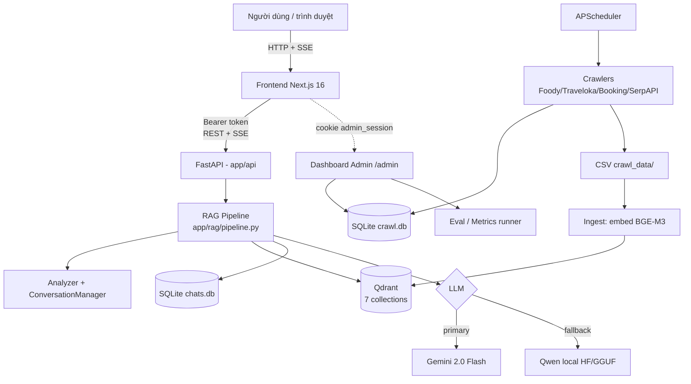
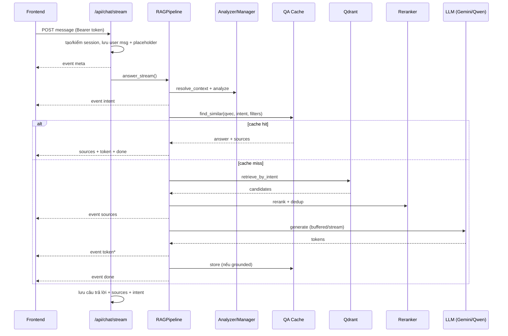
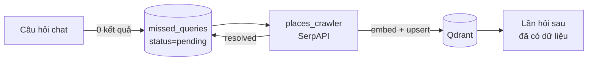

# Mô tả đầy đủ chức năng & luồng hoạt động hệ thống

> Tài liệu kỹ thuật tổng quan cho **PPBL_chat** — chatbot RAG tư vấn du lịch Đà Nẵng.
> Mô tả hệ thống *như đang có trong mã nguồn*. Các tài liệu liên quan:
> [`auth-dang-nhap-usecase.md`](auth-dang-nhap-usecase.md) (đăng nhập/phân quyền),
> [`rag-routing-and-memory-review.md`](rag-routing-and-memory-review.md) (định tuyến RAG & bộ nhớ).

---

## 1. Tổng quan & mục tiêu

Hệ thống là một **trợ lý du lịch Đà Nẵng** trả lời câu hỏi của khách (khách sạn, nhà hàng,
địa điểm, đánh giá, sự kiện, lập lịch trình) bằng tiếng Việt, dựa trên **RAG**
(Retrieval-Augmented Generation): truy hồi dữ liệu thực tế đã thu thập từ Foody/Traveloka/
Booking/SerpAPI rồi để LLM tổng hợp câu trả lời *có dẫn nguồn*, không bịa.

**Stack chính:**

| Tầng | Công nghệ |
|------|-----------|
| Frontend | Next.js 16 (App Router), React Query, Tailwind, SSE client |
| Backend | FastAPI (Python), `sse-starlette`, APScheduler |
| Vector DB | Qdrant (7 collection, embedding **BGE-M3** 1024 chiều) |
| Embedding | `BAAI/bge-m3` (SentenceTransformer) |
| Reranker | `BAAI/bge-reranker-v2-m3` (CrossEncoder, có thể tắt) |
| LLM sinh câu trả lời | **Gemini 2.0 Flash** (primary, qua REST) ↔ **Qwen** local (HF Transformers / GGUF) làm fallback |
| LLM phân tích intent | Qwen2.5-0.5B-Instruct (model nhỏ riêng, nhanh) |
| CSDL quan hệ | SQLite — `chats.db` (app), `crawl.db` (crawl admin) |
| Thu thập dữ liệu | Playwright (Foody/Traveloka/Booking) + SerpAPI (địa điểm) |

**Đặc điểm thiết kế nổi bật:**
- Định tuyến theo **11 intent** → mỗi intent có đường xử lý + tập collection riêng.
- **QA cache ngữ nghĩa**: câu hỏi gần trùng câu đã trả lời tốt → trả ngay, bỏ qua LLM.
- **Bộ nhớ hội thoại**: giải đại từ ("chỗ đó", "nó"), nhận diện đổi chủ đề, tóm tắt lịch sử.
- **Vòng lặp tự bổ sung dữ liệu**: câu hỏi không có kết quả → ghi `missed_queries` → crawler bổ sung.
- **1 inference lock**: chỉ 1 lượt sinh chạy đồng thời (chống tràn VRAM khi dùng GPU đơn).

---

## 2. Kiến trúc tổng thể



Toàn bộ chạy trong **một tiến trình FastAPI** (`backend/app/main.py`): pipeline, scheduler crawl,
dashboard admin và các API người dùng dùng chung embedder/Qdrant/DB. Dashboard admin
(`backend/app/admin_app.py`) cũng có thể chạy độc lập, nhẹ (không nạp LLM) để quản trị crawl/metrics.

---

## 3. Backend — RAG Pipeline (lõi)

Toàn bộ logic trả lời nằm ở `backend/app/rag/pipeline.py`, lớp `RAGPipeline.answer_stream()` —
một *async generator* phát ra các sự kiện (`intent` → `sources` → `token*` → `done`).

### 3.1. Các thành phần

| Module | Trách nhiệm |
|--------|-------------|
| `rag/analyzer.py` — `LLMQueryAnalyzer.analyze()` | Dùng LLM nhỏ bóc tách JSON `{needs_rag, intent, entity[], rewritten_query, filters}`. Có regex ép `event_search` khi câu hỏi nhắc "sự kiện/lễ hội/festival". Lỗi parse → fallback `GENERAL`. |
| `rag/manager.py` — `ConversationManager` | `resolve_context()` phát hiện follow-up / topic-shift, thay đại từ bằng tên thực thể từ lượt trước → câu hỏi độc lập (`standalone_query`). `summarize_history()` nén lịch sử (chạy nền). `build_final_context_prompt()` dựng lại message từ summary + lịch sử gần. |
| `rag/intent.py` — `QueryIntent`, `CollectionRegistry` | Enum 11 intent + bản đồ intent → collection (kèm trọng số ưu tiên). |
| `rag/retrieval.py` — `retrieve_by_intent()` | Encode câu hỏi (BGE-M3) → query các collection theo intent → lọc cứng (quận, rating, khoảng giá, hạng sao) → trả `SearchResultSchema`. Tự lấy thực thể cha cho review/room. |
| `rag/rerank.py` — `rerank_results()` | CrossEncoder chấm điểm (logit → sigmoid) + **heuristic**: +0.3 trùng quận, +0.15…0.4 theo rating/số đánh giá, −0.8 phạt lệch loại ("hải sản" nhưng ra "gà rán"), cộng điểm khớp metadata (cuisine, tags, view, bed_type). Trả top‑K. |
| `rag/llm.py` — `QwenHF`/`QwenGGUF`, `generate_streaming()` | Bọc LLM local theo API kiểu llama.cpp; stream qua `TextIteratorStreamer` + thread daemon (không chặn event loop). |
| `rag/gemini_fallback.py` — `generate_gemini_streaming()` | Stream từ Gemini REST (`:streamGenerateContent`), chuyển message OpenAI-style → Gemini, có **circuit breaker** (tạm bỏ Gemini sau khi nhận 429/503). |
| `db/qa_cache.py` — `find_similar()`, `store()` | Cache ngữ nghĩa: cosine ≥ `QA_CACHE_SIM_THRESHOLD` (0.93) + cùng intent + cùng filters. |
| `rag/memory.py` | `extract_session_prefs()` (lưu filter vào `session_context`), `merge_session_prefs()` (điền filter còn trống từ ngữ cảnh), `build_history_messages()`. |

### 3.2. Luồng end-to-end một câu hỏi chat

Các bước trong `answer_stream()` (đã đánh số theo mã nguồn):

1. **Nạp ngữ cảnh phiên** — lấy `session.summary`; nếu lịch sử ≥ 10 lượt → tạo task nền tóm tắt.
2. **`resolve_context()`** — ra `standalone_query`; nếu *đổi chủ đề* thì xoá lịch sử cho lượt này.
3. **`analyzer.analyze()`** — ra `intent`, `rewritten_query`, `filters`. → phát sự kiện **`intent`**.
4. **Nạp `session_context`** + lưu preference mới (quận/giá/rating người dùng vừa nêu).
5. **Nạp hồ sơ cá nhân hoá** (nếu có `profile_session_id`) → đoạn note chèn vào system prompt.
6. **Rẽ nhánh theo intent:**
   - **CHITCHAT** → không RAG, trả lời trực tiếp (`_CHITCHAT_SYSTEM_PROMPT`). Kết thúc.
   - **EVENT_SEARCH** → bỏ qua Qdrant, đọc bảng `events` trong SQLite (`retrieve_events`),
     stream câu trả lời. Kết thúc.
   - *(còn lại đi tiếp)*
7. **Trộn filter** (`_merge_filters` → `merge_session_prefs`): **FE sidebar thắng** từng field,
   analyzer điền field trống, `max_price` lấy `min()` của 2 nguồn; cuối cùng ngữ cảnh phiên điền nốt.
8. **QA cache** (nếu intent cacheable & **không** cá nhân hoá): embed câu hỏi 1 lần (`qvec`),
   `find_similar()`. Trúng → phát `sources` + `token` (nội dung cache) + `done`. **Kết thúc.**
9. **Truy hồi (retrieve):**
   - **ITINERARY_SEARCH** → `_run_itinerary_planner()` sinh khung lịch trình JSON (ngày/buổi/
     query/collection_type); mỗi buổi: retrieve 15 → rerank → chọn 2 địa điểm *chưa trùng*
     (mở rộng toàn thành phố nếu quận rỗng). Ghép thành `prebuilt_context`, **bỏ rerank toàn cục**.
   - *Các intent khác* → `retrieve_by_intent()` với `TOP_K_RETRIEVE` (15).
10. **Rerank + dedup** (trừ itinerary): `rerank_results()` lấy `TOP_K_RERANK` (5), rồi
    `_dedup_by_display_name()`.
11. **Xử lý SPECIFIC_SEARCH**: `_find_exact_matches()` — nếu khớp đúng tên → thu hẹp về đúng
    thực thể; nếu chỉ gần đúng → phát thông điệp "Có phải bạn muốn tìm…" + ghi `missed_queries` + dừng.
12. → phát sự kiện **`sources`** (tối đa 10, itinerary 30).
13. **Không có kết quả & intent crawlable** → ghi `missed_queries` (để crawler bổ sung sau).
14. **Sinh câu trả lời:**
    - Nếu `USE_GEMINI_GENERATION` → gọi Gemini, **buffer toàn bộ** rồi mới phát (đảm bảo không
      bị cụt giữa chừng; nếu 0 kết quả thì để Gemini trả lời từ kiến thức chung + *disclaimer*).
      Gemini lỗi → tự sinh lại bằng **Qwen local**.
    - Ngược lại → stream trực tiếp từ Qwen local (`generate_streaming`), kèm đo TTFT.
    - → phát chuỗi sự kiện **`token`**.
15. **Lưu QA cache** (chỉ khi *grounded* — có dữ liệu nội bộ — và không cá nhân hoá).
16. → phát **`done`**.



### 3.3. Bản đồ intent → collection (`CollectionRegistry`)

| Intent | Collection truy hồi |
|--------|---------------------|
| `hotel_search` | hotels → reviews → rooms (accommodation) |
| `restaurant_search` | restaurants → restaurant_reviews |
| `place_search` | places → place_reviews |
| `review_search` | place_reviews + restaurant_reviews + accommodation_reviews |
| `room_search` | rooms → hotels → accommodation_reviews |
| `price_search` | hotels + restaurants |
| `itinerary_search` | hotels + restaurants + places (mỗi buổi 1 collection) |
| `specific_search` / `general` | 3 collection thực thể + 3 collection review |
| `event_search` | *(không Qdrant — đọc bảng `events` SQLite)* |
| `chitchat` | *(không truy hồi)* |

---

## 4. Tầng API

App lắp ráp trong `backend/app/main.py` (CORS cho `localhost:3000`, mount router + static admin,
middleware `admin_guard`). Tất cả endpoint người dùng yêu cầu **Bearer token**
(`get_current_user` trong `api/deps.py`).

| Router (file) | Endpoint chính | Chức năng |
|---------------|----------------|-----------|
| `api/auth.py` | `POST /api/auth/{login,register,logout}`, `GET /api/auth/me` | Đăng ký/đăng nhập/đăng xuất, trả `{id, username, role}` |
| `api/chat.py` | `POST /api/chat/stream` | **Chat SSE** (xem dưới) |
| `api/sessions.py` | `GET/POST/PATCH/DELETE /api/sessions[...]` | Quản lý phiên & tin nhắn |
| `api/profile.py` | `GET/PUT/DELETE /api/profile/{sid}` | Hồ sơ du lịch cá nhân hoá |
| `api/recommend.py` | `POST /api/recommend` | Gợi ý theo hồ sơ + bộ lọc |
| `api/events.py` | `GET /api/events` | Sự kiện sắp diễn ra |
| `api/favorites.py` | `POST/GET/DELETE /api/favorites[...]` | Địa điểm yêu thích |
| `api/itineraries.py` | `POST/GET/DELETE /api/itineraries[...]` | Lịch trình đã lưu (markdown) |
| `api/admin.py` | `POST /api/admin/crawl/{events,places}` | Kích crawl thủ công (bảo vệ bằng `ADMIN_TOKEN`) |
| `api/admin_auth.py` | `GET/POST /admin/login`, `GET /admin/logout` | Cổng cookie cho dashboard |
| `api/admin_shell.py`, `crawl_admin.py`, `metrics_admin.py` | `GET /admin`, `/admin/crawl`, `/admin/metrics` | Dashboard quản trị |
| `api/health.py` | `GET /api/health` | Kiểm tra sống |

### 4.1. `POST /api/chat/stream` — giao thức SSE

Endpoint trả `EventSourceResponse` (heartbeat 15s). Trước khi gọi pipeline: nếu `session_id`
thiếu/không thuộc user → tạo session mới; lưu tin nhắn user + placeholder assistant; chặn
`profile_session_id` chéo tài khoản. Dùng **`inference_lock`** (1 lượt/lúc) — nếu đang bận, phát
`waiting`. Cuối cùng (kể cả khi hủy) **luôn** lưu câu trả lời + `sources_json` + `intent`.

Chuỗi sự kiện gửi về client:

| Event | Dữ liệu | Ý nghĩa |
|-------|---------|---------|
| `meta` | `session_id`, `user_message_id`, `assistant_message_id`, `server_time` | Khởi tạo |
| `waiting` | `message` | Đang chờ lock (có request khác) |
| `intent` | `value`, `display` | Intent đã phân loại |
| `sources` | `items[]`, `total` | Danh sách nguồn (thẻ địa điểm) |
| `fallback` | `reason`, `provider`, `model` | Đang dùng Gemini do không có dữ liệu nội bộ |
| `token` | `text` | Một mảnh câu trả lời (stream) |
| `error` | `message`, `error_id?` | Lỗi (client chỉ thấy mã, log đầy đủ ở server) |
| `done` | `finish_reason` | Kết thúc |

Intent lưu vào DB ưu tiên: `error` > `gemini_fallback` > intent gốc — để khi tải lại hội thoại
không hiểu nhầm câu trả lời lỗi/cụt là hoàn chỉnh.

---

## 5. Frontend — Next.js 16 (App Router)

### 5.1. Bản đồ route

| Route | File | Chức năng | Cần đăng nhập |
|-------|------|-----------|:---:|
| `/` | `app/page.tsx` | Chuyển hướng `/chat` | ✓ |
| `/login`, `/register` | `app/{login,register}/page.tsx` | Đăng nhập / đăng ký | ✗ (public) |
| `/chat`, `/chat/[sessionId]` | `app/chat/...` | Màn chat + sidebar lọc | ✓ |
| `/recommend` | `app/recommend/page.tsx` | Gợi ý cá nhân hoá | ✓ |
| `/saved` | `app/saved/page.tsx` | 2 tab: Địa điểm + Lịch trình | ✓ |
| `/itineraries/[id]` | `app/itineraries/[id]/page.tsx` | Chi tiết lịch trình (markdown, tải/in) | ✓ |
| `/profile` | `app/profile/page.tsx` | Hồ sơ du lịch | ✓ |

### 5.2. Luồng xác thực (`app/auth-provider.tsx`)

- Token lưu trong `localStorage`; mọi request gắn header `Authorization: Bearer <token>`
  (`lib/api.ts`). Sau mount đọc token → gọi `GET /api/auth/me` lấy `{id, username, role}`.
- **Guard**: route không thuộc `PUBLIC_ROUTES` (`/login`, `/register`) mà chưa có token → đẩy
  về `/login`. Đang xác thực thì hiện "Đang tải…" để tránh nháy.
- **Phân quyền**: link **Admin** ở `TopAppBar.tsx` chỉ hiện khi `user.role === "admin"`, mở
  `/admin` (do backend phục vụ) ở tab mới.
- `login()` / `register()` → lưu token, set cache `me`, chuyển `/chat`. `logout()` → gọi API,
  xoá token, `router.replace("/login")`.

### 5.3. Trải nghiệm chat & các luồng người dùng

- Gửi tin nhắn → `POST /api/chat/stream`, đọc **SSE** (`lib/sse.ts`): cập nhật intent badge,
  thẻ nguồn (SourceCard), nội dung stream từng chữ; nút **Stop** (Esc) hủy giữa chừng.
- Sidebar lọc (quận / rating / giá) ghi vào query param và gửi kèm — *ưu tiên cao hơn* analyzer.
- Khi intent là `itinerary_search` → hiện nút **Lưu lịch trình** → `POST /api/itineraries`.

```
Luồng 1: Đăng ký → Chat → Lưu lịch trình
  /register → /chat → gửi câu hỏi lịch trình → "Lưu lịch trình" → /saved → /itineraries/{id} (tải/in)

Luồng 2: Hồ sơ → Gợi ý → Yêu thích
  /profile (sở thích, ngân sách, ngày) → /recommend → bấm ♥ → /saved (tab Địa điểm)
```

---

## 6. Hệ dữ liệu

### 6.1. SQLite

**`chats.db`** (`backend/app/db/schema.sql`):

| Bảng | Vai trò |
|------|---------|
| `users` | Tài khoản (PBKDF2-HMAC-SHA256, cột `role` = `user`/`admin`) |
| `auth_tokens` | Token opaque — chỉ lưu `sha256(token)`, TTL mặc định 30 ngày |
| `sessions` | Phiên chat (có `user_id` chủ sở hữu, `summary` tóm tắt) |
| `messages` | Tin nhắn (`role`, `content`, `sources_json`, `intent`) |
| `profiles` | Hồ sơ du lịch theo phiên (`profile_json`) |
| `events` | Sự kiện đã crawl (SerpAPI), unique theo `(source, source_event_id)` |
| `session_context` | Bộ lọc/sở thích trong phiên (`context_json`) |
| `qa_cache` | Cache câu trả lời: `question_vec` (BLOB float32×1024), `intent`, `filters_json`, `hit_count` |
| `missed_queries` | Câu hỏi không có kết quả (`status`: pending/resolved/not_found) |
| `favorites` | Địa điểm yêu thích theo `client_id` (không FK → sống sót khi xoá phiên), `snapshot_json` |
| `itineraries` | Lịch trình đã lưu (`content_md`) |

**`crawl.db`** (`backend/app/crawl_admin/schema.sql`): `sources` (URL Foody thủ công),
`entities` (nhà hàng/khách sạn đã crawl, `data_json`), `engine_state`, `crawl_runs`, `crawl_logs`.

### 6.2. Qdrant — 7 collection

`places_danang`, `place_reviews_danang`, `restaurants_danang`, `restaurant_reviews_danang`,
`accommodation_hotels_danang`, `accommodation_rooms_danang`, `accommodation_reviews_danang`.
Payload gồm metadata thực thể (tên, quận, địa chỉ, rating, giá), trường giàu (cuisine, hạng sao,
view/bed_type phòng, tags, giờ mở cửa) và quan hệ `parent_entity_id` (review/room → thực thể cha).

---

## 7. Crawl & Ingest (thu thập + nạp dữ liệu)

**Nguồn:**
- **Foody** (Playwright) — nhà hàng/quán: discovery qua API listing → chi tiết + đánh giá.
- **Traveloka / Booking** (Playwright) — khách sạn: phòng, giá, đánh giá, chính sách, ảnh.
- **SerpAPI** (Google Local) — địa điểm: chạy *theo nhu cầu* để giải quyết `missed_queries`.

**Pipeline nạp** (`backend/app/crawl_admin/ingest.py`): CSV (`backend/crawl_data/...`) → Pandas →
`build_*()` chuẩn hoá (tách quận, sinh `stable_uuid` để cùng thực thể không bị trùng giữa các lần
crawl) → **embed BGE-M3** → `upsert_docs()` vào Qdrant (có xử lý OOM/retry). Embedder **dùng chung**
với pipeline chat (`set_shared_embedder`) để không nạp model 2 lần.

**Điều phối** (`crawl_admin/orchestrator.py`): khoá chạy đơn (`_run_lock`), log real-time qua
`logbus` (stream SSE lên dashboard).

**Vòng lặp tự bổ sung dữ liệu:**



Crawler chạy định kỳ bằng **APScheduler** (trong `lifespan`): event crawl mỗi `CACHE_TTL_HOURS`,
missed-place mỗi `PLACE_CRAWL_INTERVAL_HOURS`, new-places mỗi `NEW_PLACES_CRAWL_INTERVAL_HOURS`,
và auto-crawl khách sạn/nhà hàng (mặc định TẮT, bật bằng `CRAWL_SCHEDULE_ENABLED`).

---

## 8. Dashboard Admin

Hai dashboard do backend phục vụ HTML, gác bằng **cookie** (không dùng Bearer như API người dùng
vì đây là trang trình duyệt điều hướng trực tiếp).

- **`/admin/crawl`** — điều phối crawl: chạy từng engine / chạy tất cả, xem lịch sử run, log
  thời gian thực (SSE), quản lý nguồn URL Foody, xem entities/hotels đã crawl.
- **`/admin/metrics`** — chạy bộ benchmark RAG (suite `general`/`itinerary`/`both`), báo cáo
  pass/fail, xuất CSV.

**Cổng admin** (`api/admin_auth.py`): cookie `admin_session` (HttpOnly, Path=`/admin`, TTL 8h,
token PBKDF2 như tài khoản thường). Middleware `admin_guard` chặn mọi `/admin*` (trừ
login/logout/static), **fail-closed** (lỗi → coi như chưa xác thực). Chi tiết kịch bản & phân quyền:
xem [`auth-dang-nhap-usecase.md`](auth-dang-nhap-usecase.md).

---

## 9. Cấu hình & vận hành

**Biến cấu hình chính** (`backend/app/config.py`, qua `.env`):

| Nhóm | Biến tiêu biểu |
|------|----------------|
| Qdrant | `QDRANT_URL`, `QDRANT_API_KEY` |
| Model | `EMBED_MODEL_NAME`, `LLM_HF_MODEL_NAME`, `USE_GGUF`/`LLM_GGUF_PATH`, `ANALYZER_HF_MODEL_NAME`, `LLM_LOAD_IN_4BIT` |
| Gemini | `GEMINI_API_KEY`, `GEMINI_MODEL`, `USE_GEMINI_GENERATION`, `GEMINI_*_COOLDOWN_SECONDS` |
| Truy hồi/rerank | `ENABLE_RERANKER`, `RERANKER_MODEL_NAME`, `TOP_K_RETRIEVE` (15), `TOP_K_RERANK` (5), `SCORE_THRESHOLD` (0.3) |
| QA cache | `QA_CACHE_ENABLED`, `QA_CACHE_SIM_THRESHOLD` (0.93), `QA_CACHE_TTL_DAYS` (7), `QA_CACHE_MAX_ROWS` (500) |
| Sinh | `DEFAULT_MAX_TOKENS` (512), `DEFAULT_TEMPERATURE` (0.2), `MAX_HISTORY_TURNS` (5), `MAX_CONTEXT_CHARS` (4000) |
| Crawl | `SERPAPI_KEY`, `CACHE_TTL_HOURS`, `PLACE_CRAWL_INTERVAL_HOURS`, `MAX_PLACE_RETRY` |

**Khởi động (`lifespan`):** chọn device (cuda/cpu) → nạp embedder → nạp reranker (nếu bật) →
nạp LLM chính (+ analyzer riêng nếu khác) → kết nối Qdrant → tạo `RAGPipeline` → chia sẻ embedder
cho ingest → init 2 DB → start scheduler crawl → **warm-up** (1 query giả để nóng GPU) → sẵn sàng.
**Tắt:** dừng scheduler, đóng DB + Qdrant.

**Đồng thời:** `inference_lock` (1 lượt sinh/lúc) chống tràn VRAM; I/O Qdrant/DB/stream LLM đều
bất đồng bộ; tóm tắt lịch sử & ghi cache chạy nền best-effort (lỗi không làm vỡ câu trả lời).

---

## 10. Phụ lục — file quan trọng

| Thành phần | Đường dẫn |
|------------|-----------|
| Lắp ráp app + lifespan | `backend/app/main.py` |
| Cấu hình | `backend/app/config.py` |
| Pipeline RAG (lõi) | `backend/app/rag/pipeline.py` |
| Phân tích intent/filter | `backend/app/rag/analyzer.py` |
| Bộ nhớ hội thoại | `backend/app/rag/manager.py`, `backend/app/rag/memory.py` |
| Intent ↔ collection | `backend/app/rag/intent.py` |
| Truy hồi / rerank | `backend/app/rag/retrieval.py`, `backend/app/rag/rerank.py` |
| LLM local / Gemini | `backend/app/rag/llm.py`, `backend/app/rag/gemini_fallback.py` |
| QA cache | `backend/app/db/qa_cache.py` |
| Chat SSE endpoint | `backend/app/api/chat.py` |
| Auth + cổng admin | `backend/app/api/auth.py`, `backend/app/api/admin_auth.py`, `backend/app/db/auth.py` |
| Schema DB | `backend/app/db/schema.sql`, `backend/app/crawl_admin/schema.sql` |
| Crawl + ingest | `backend/app/crawl_admin/` (`ingest.py`, `orchestrator.py`, engines), `backend/app/crawlers/` |
| Frontend auth | `frontend/app/auth-provider.tsx`, `frontend/lib/{api,auth,sse}.ts` |
| Frontend chat | `frontend/hooks/useChat.ts`, `frontend/components/chat/` |
